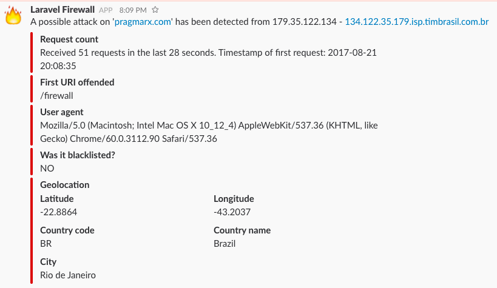
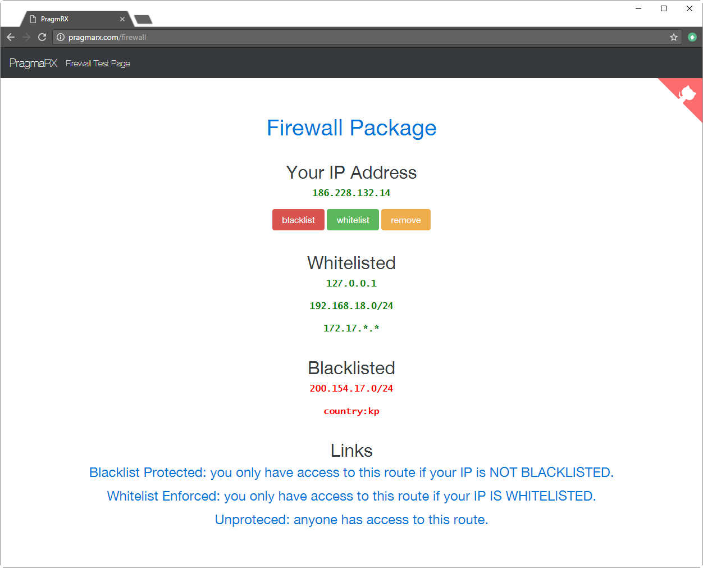

# Firewall 2.2

[](https://packagist.org/packages/pragmarx/firewall) [](LICENSE) [](https://packagist.org/packages/pragmarx/firewall) [](https://scrutinizer-ci.com/g/antonioribeiro/firewall/?branch=master) [](https://scrutinizer-ci.com/g/antonioribeiro/firewall/?branch=master) [](https://scrutinizer-ci.com/g/antonioribeiro/firewall/?branch=master) [](https://styleci.io/repos/15290899)

## Purpose

This a "soft-firewall" package. Its purpose is to help people prevent unauthorized access to routes **by IP address**. It is able to keep track of IPs, countries and hosts (dynamic ip), and redirect non-authorized users to, for instance, a "Coming Soon" page, while letting whitelisted IPs to have access to the entire site. It is now also able to detect and block attacks (too many requests) from single IPs or whole countries.

This package can prevent some headaches and help you block some access to your apps, but cannot replace firewalls and appliances, for attacks at the network level, you'll still need a real firewall. 

## Features

* Control access to routes and groups via black and white lists.
* Detect and block attacks to your application, from IP addresses or countries.
* Send Slack notifications in attack events.
* Allow whitelisted to access the whole site and send everyone else to a "coming soon page".
* Redirect blacklisted users to some other page.
* Use database or arrays to store IP lists.
* Whitelist your development machine using a dynamic DNS host name.
* Done using middleware, so you can protect/unprotect groups of routes.
* All features are available for hosts, IP addresses, ranges of IP addresses and whole countries.
* Super fast, less than 10ms increase in each request.
* Highly configurable.

## Concepts

### Blacklist

All IP addresses in those lists will no be able to access routes filtered by the blacklist filter.

### Whitelist

Those IP addresses, ranges or countries can

- Access blacklisted routes even if they are in a range of blacklisted IP addresses.
- Access 'allow whitelisted' filtered routes.
- If a route is filtered by the 'allow whitelisted' filter and the IP is not whitelisted, the request will be redirected to an alternative url or route name.

## Attack Detection



Firewall is able to detect simple attacks to your page, by counting requests from the same IP or country. Just enable it on your `config/firewall.php` and, to receive notifications, configure the Slack service in `config/services.php`:
   
```php
'slack' => [
    'webhook_url' => env('SLACK_WEBHOOK_URL'),
],
```

and add the route notification method to your user model:

```php
/**
 * Route notifications for the Slack channel.
 *
 * @return string
 */
public function routeNotificationForSlack()
{
    return config('services.slack.webhook_url');
}
``` 

## IPs lists

IPs (white and black) lists can be stored in array, files and database. Initially database access to lists is disabled, so, to test your Firewall configuration you can publish the config file and edit the `blacklist` or `whitelist` arrays:

```php
'blacklist' => array(
    '127.0.0.1',
    '192.168.17.0/24'
    '127.0.0.1/255.255.255.255'
    '10.0.0.1-10.0.0.255'
    '172.17.*.*'
    'country:br'
    '/usr/bin/firewall/blacklisted.txt',
),
```

The file (for instance `/usr/bin/firewall/blacklisted.txt`) must contain one IP, range or file name per line, and, yes, it will search for files recursively, so you can have a file of files if you need:

```
127.0.0.2
10.0.0.0-10.0.0.100
/tmp/blacklist.txt
```

## Redirecting non-whitelisted IP addresses

Non-whitelisted IP addresses can be blocked or redirected. To configure redirection you'll have to publish the  `config.php` file and configure:

```php
'redirect_non_whitelisted_to' => 'coming/soon',
```

## Artisan Commands

You have access to the following commands:

#### Global

```
  firewall:cache:clear  Clear the firewall cache.
  firewall:list         List all IP address, white and blacklisted.
  firewall:updategeoip  Update the GeoIP database.
```

#### When database is enabled

```
  firewall:blacklist          Add an IP address to blacklist.
  firewall:clear              Remove all ip addresses from white and black lists.
  firewall:remove             Remove an IP address from white or black list.
  firewall:whitelist          Add an IP address to whitelist.
```

Those are results from `firewall:list`:

```
+--------------+-----------+-----------+
| IP Address   | Whitelist | Blacklist |
+--------------+-----------+-----------+
| 10.17.12.7   |           |     X     |
| 10.17.12.100 |     X     |           |
| 10.17.12.101 |     X     |           |
| 10.17.12.102 |     X     |           |
| 10.17.12.200 |           |     X     |
+--------------+-----------+-----------+
```

```
+-----------------------+-----------+-----------+
| IP Address            | Whitelist | Blacklist |
+-----------------------+-----------+-----------+
| 172.0.0.0-172.0.0.255 |           |     X     |
| country:br            |           |     X     |
| host:mypc.myname.com  |     X     |           |
+-----------------------+-----------+-----------+
```

## Facade

You can also use the `Firewall Facade` to manage the lists:

```php
$whitelisted = Firewall::isWhitelisted('10.17.12.1');
$blacklisted = Firewall::isBlacklisted('10.0.0.3');

Firewall::whitelist('192.168.1.1');
Firewall::blacklist('10.17.12.1', true); /// true = force in case IP is whitelisted
Firewall::blacklist('127.0.0.0-127.0.0.255');
Firewall::blacklist('200.212.331.0/28');
Firewall::blacklist('country:br');

if (Firewall::whichList($ip) !== false)  // returns false, 'whitelist' or 'blacklist'
{
    Firewall::remove($ip);
}
```

Return a blocking access response:

```php
return Firewall::blockAccess();
```

Suspicious events will be (if you wish) logged, so `tail` it:

```
php artisan tail
```

## Blocking Whole Countries

You can block a country by, instead of an ip address, pass `country:<2-letter ISO code>`. So, to block all Brazil's IP addresses, you do:

```
php artisan firewall:blacklist country:br
```

You will have to add this requirement to your `composer.json` file:

```
"geoip/geoip": "~1.14"
```

or

```
"geoip2/geoip2": "~2.0"
```

You need to enable country search on your firewall.php config file: 

```php
'enable_country_search' => true,
```

And you can schedule this command to update your cities GeoIp database regularly: 

```
php artisan firewall:updategeoip
```

You can find those codes here: [isocodes](http://www.spoonfork.org/isocodes.html)

## Session Blocking

You can block users from accessing some pages only for the current session, by using those methods:

```php
Firewall::whitelistOnSession($ip);
Firewall::blacklistOnSession($ip);
Firewall::removeFromSession($ip);
```

## Playground & Bootstrap App 

Click [here](http://pragmarx.com/firewall) to see it working and in case you need a help figuring out things, try [this repository](https://github.com/antonioribeiro/pragmarx.com). 



## Installation

### Compatible with

- Laravel 4+ (version 1.*) 
- Laravel 5.0, 5.1, 5.2 and 5.3 (version 1.*)
- Laravel 5.4, 5.5, 5.6 and 5.7 (version 2.*)

### Installing

Require the Firewall package using [Composer](https://getcomposer.org/doc/01-basic-usage.md):

```
composer require pragmarx/firewall
```

* Laravel 5.5 and up

    You don't have to do anything else, this package uses Package Auto-Discovery's feature, and should be available as soon as you install it via Composer.

* Laravel 5.4 and below

    Add the Service Provider and the Facade to your app/config/app.php:

```php
PragmaRX\Firewall\Vendor\Laravel\ServiceProvider::class,
```

```php
'Firewall' => PragmaRX\Firewall\Vendor\Laravel\Facade::class,
```

Add middlewares to your app/Http/Kernel.php

```php
protected $routeMiddleware = [
    ...
    'fw-only-whitelisted' => \PragmaRX\Firewall\Middleware\FirewallWhitelist::class,
    'fw-block-blacklisted' => \PragmaRX\Firewall\Middleware\FirewallBlacklist::class,
    'fw-block-attacks' => \PragmaRX\Firewall\Middleware\BlockAttacks::class,
];
```

or 

```php
protected $middlewareGroups = [
    'web' => [
        ...
    ],

    'api' => [
        ...
    ],
    
    'firewall' => [
        \PragmaRX\Firewall\Middleware\FirewallBlacklist::class,
        \PragmaRX\Firewall\Middleware\BlockAttacks::class,
    ],
];
```

Then you can use them in your routes:

```php
Route::group(['middleware' => 'fw-block-blacklisted'], function () 
{
    Route::get('/', 'HomeController@index');
});
```

Or you could use both. In the following example the allow group will give free access to the 'coming soon' page and block or just redirect non-whitelisted IP addresses to another, while still blocking access to the blacklisted ones.

```php
Route::group(['middleware' => 'fw-block-blacklisted'], function () 
{
    Route::get('coming/soon', function()
    {
        return "We are about to launch, please come back in a few days.";
    });

    Route::group(['middleware' => 'fw-only-whitelisted'], function () 
    {
        Route::get('/', 'HomeController@index');
    });
});
```

**Note:** You can add other middleware you have already created to the new groups by simply 
adding it to the `fw-allow-wl` or `fw-block-bl` middleware group.

Migrate your database

```
php artisan migrate
```

**Warning:** If you already have a Firewall package installed and migrated, you need to update your migration name, in the `migrations` table, to `2014_02_01_311070_create_firewall_table`, otherwise the migrate command will fail tell you the table already exists.  

To publish the configuration file you'll have to:

**Laravel 4**

```
php artisan config:publish pragmarx/firewall
```

**Laravel 5**

```
php artisan vendor:publish --provider="PragmaRX\Firewall\Vendor\Laravel\ServiceProvider"
```

## TODO

- Tests, tests, tests.

## Author

[Antonio Carlos Ribeiro](http://twitter.com/iantonioribeiro) 

## License

Firewall is licensed under the BSD 3-Clause License - see the `LICENSE` file for details

## Contributing

Pull requests and issues are more than welcome.
